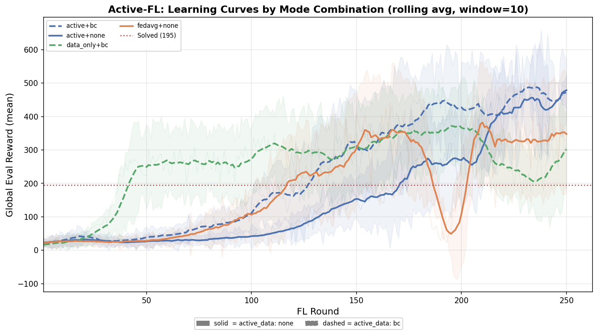
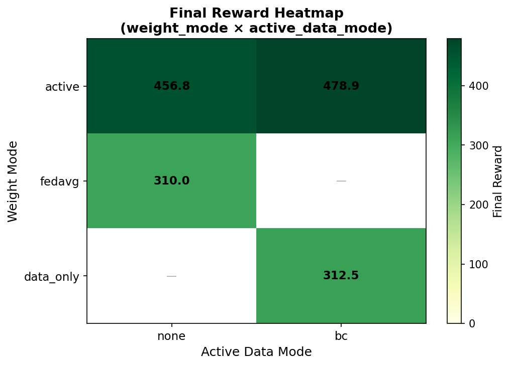
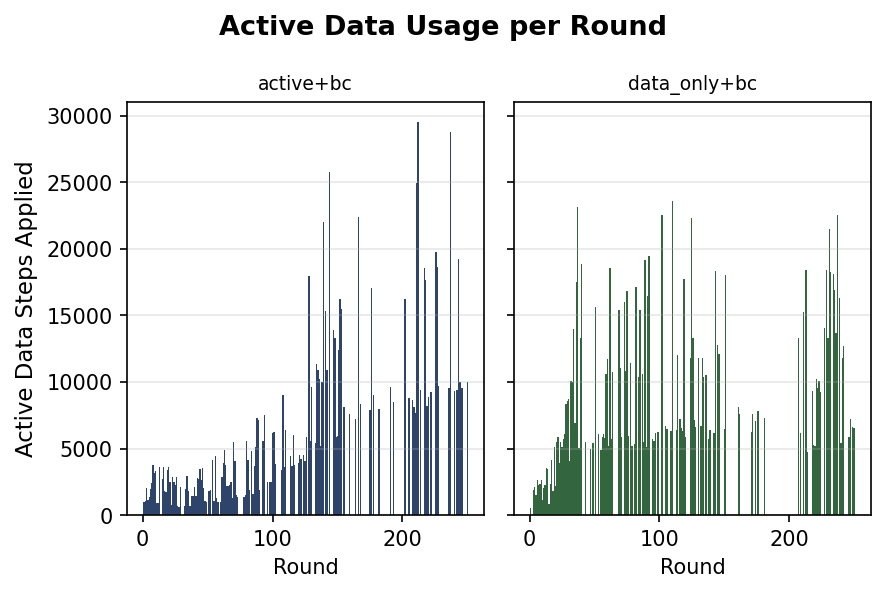
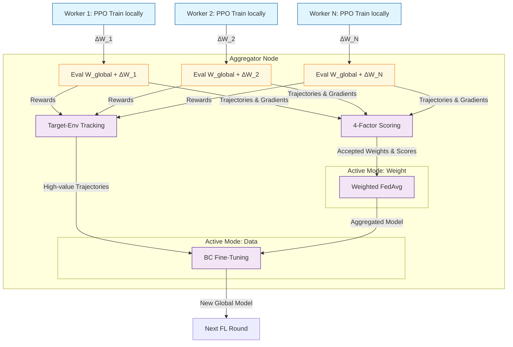

# Active-Federated Learning on CartPole

> **Disclaimer**: This is a personal exploration project, not a formal research paper or production framework.

> **Federated Learning with active learning** — Distributed workers train in parallel, but instead of naive FedAvg, two active learning strategies select and improve the global model each round based on target-environment evaluation probes.

---

## The Problem: Why Active Learning in Federated Learning?

In many Federated Learning scenarios, standard **FedAvg** works well when client datasets are relatively static and similar. However, it often struggles due to **non-stationarity and catastrophic forgetting**:
1. **High Variance in Updates**: Workers explore different parts of the environment or train on diverse local data. A client stuck in a bad local optimum will send a gradient update that disrupts the global model's progress.
2. **Sample and Resource Inefficiency**: Training locally requires interacting with environments or crunching local data. Blindly averaging bad weights means the global model regresses, wasting the compute and samples workers just collected.

**The Solution**: Instead of blindly averaging weights, the central aggregator uses a **Target-Environment Probe**. We evaluate each worker's weight update (*ΔW*) directly on the target environment.
- We only keep updates that actually improve the global model **(Active Weight)**.
- For clients that *do* improve the model, we collect their successful rollout trajectories and use them to explicitly fine-tune the global model **(Active Data)**.

---

## Experiment Results

Running all active learning combinations locally (`make run-experiments`) generates these comparison plots automatically:

### 1. Faster Convergence (Learning Curves)
*Active data paths (Green/Red/Purple) reach the solved threshold much faster and with lower variance than the FedAvg baseline (Orange).*


### 2. Final Performance (Heatmap)
*Using Active Data (BC) strictly dominates having no active data. Combining both Active Weight + Active Data yields the highest, most stable final rewards.*


### 3. Fine-Tuning Efficiency (Active Data Usage)
*Fine-tuning only fires when a client proves it has found a better policy. Notice how usage drops off once the environment is solved.*


---

## Architecture & Active Methods



Configure modes via `config/local.yaml` or `config/k8s.yaml`:

| `weight_mode` | `active_data_mode` | Description |
|---|---|---|
| `fedavg` | `none` | **Baseline** — vanilla equal-weight FedAvg, no active learning |
| `active` | `none` | **Active Weight only** — scored, importance-weighted FedAvg |
| `data_only` | `bc` | **Active Data only** — skip weight avg, BC fine-tune on probe trajectories |
| `active` | `bc` | **Both active paths** — scored FedAvg + BC fine-tune |

### Method 1: Active Weight (4-Factor Scoring)
Instead of equal-weight averaging, each client's *ΔW* is scored and softmax-normalized. A client is rejected entirely if its score falls below `score_threshold`. The score combines four signals:
1. **Target-env improvement (α)**: How much did this *ΔW* increase the target environment reward?
2. **Gradient norm (β)**: Penalize clients that barely moved their weights.
3. **Weight diversity (γ)**: Cosine distance from the mean update (penalize redundant updates).
4. **TD-error penalty (δ)**: Negative penalty for training instability.

### Method 2: Active Data (Fine-Tuning)
The trajectories captured during the Evaluation Probe are extremely valuable: they are guaranteed to be on-task and come from provably improved policies. 
We collect these trajectories and explicitly fine-tune the aggregated weights:
- **`bc` (Behavioral Cloning)**: Maximize the log-likelihood of the collected actions. Fast and stable.

---

## Use Case 1: Local Experiments (fast iteration, no infrastructure)

All 4 mode combinations run in parallel subprocesses via `ProcessPoolExecutor`. No Docker, no K8s, no MinIO — just Python. After all runs finish, comparison plots are generated automatically.

**When to use:** tuning hyperparameters, comparing modes, validating methodology, CI.

```bash
# Install
make install-dev

# Run tests
make test

# Run all combinations from config/local.yaml (parallel, auto-plots)
make run-experiments

# Smoke test — override rounds/workers/episodes via ARGS
make run-experiments ARGS="--rounds 2 --workers 2 --episodes 30"

# Skip auto-plotting
make run-experiments ARGS="--no-viz"

# Cap parallel experiments (e.g. 2 at a time)
make run-experiments ARGS="--jobs 2"

# Run a single combination
make run-single WEIGHT_MODE=data_only ACTIVE_DATA_MODE=bc

# View results in MLflow UI (local ./mlruns store)
make mlflow-ui
# Open http://localhost:5000

# Regenerate comparison plots from existing results
make compare
```

Outputs saved to `results/`:
- `<run_name>.json` — per-round metrics (reward, acceptance rate, active data usage)
- `results/plots/learning_curves.png`
- `results/plots/heatmap.png`
- `results/plots/final_reward_bar.png`
- `results/plots/acceptance_rate.png`
- `results/plots/active_data_usage.png`
- `results/plots/client_improvements.png`

**Configure in `config/local.yaml`** — edit `combinations:`, training rounds, workers, etc.

---

## Use Case 2: Kubernetes / Kubeflow Pipeline (real distributed FL)

Workers run as isolated pods (true process separation), weights and artifacts flow through MinIO, and metrics are tracked in a shared MLflow server. Kubeflow Pipelines orchestrates the DAG.

**When to use:** real federated scenario (workers on different machines/data), GPU training, production-scale runs, or when you need the full MLflow + artifact tracking pipeline.

### What runs in K8s

```
Kubeflow Pipeline DAG (per FL round):
  train_workers          → PyTorchJob: N worker pods train PPO in parallel
       ↓
  score_and_aggregate    → Aggregator pod: eval probes, scoring, FedAvg + active data
       ↓                   Reads/writes weights to MinIO
  evaluate_global        → Evaluation pod: global model eval, logs all metrics to MLflow
```

### What to see in Kubeflow UI
- **Pipeline graph**: per-round DAG with `train → aggregate → evaluate` chain
- **Pod logs**: per-worker training progress, client scores, improvement values
- **Artifacts**: aggregation report JSON (accepted/rejected clients with scores)

### What to see in MLflow UI
Each round logs:
- `global_eval_reward_mean` / `_std`
- `clients_accepted` / `clients_rejected`
- `effective_weight_norm`
- `active_data_applied`, `active_data_n_steps`
- `client_<id>_score`, `client_<id>_improvement`
- Global model checkpoint artifact in `global_models/round_N/`

```bash
# Prerequisites: kind, kubectl, helm, docker

# 1. Bootstrap local kind cluster (MinIO, MLflow, Kubeflow)
make local-setup

# 2. Run pipeline (uses config/k8s.yaml)
make run-pipeline

# Open UIs (after port-forward):
#   Kubeflow: http://localhost:8080
#   MLflow:   http://localhost:5000
#   MinIO:    http://localhost:9001

# 3. Fetch K8s MLflow results + generate plots
make compare-k8s

# 4. Teardown
make local-teardown
```

---

## Project Structure

```
src/
  agent/          PPO ActorCritic model, PPO agent, worker entrypoint
  aggregator/     Evaluator, scorer, aggregator (Active Weight + Data), MinIO collector
  experiment/     Local FL runner (no K8s)
  pipelines/      Kubeflow DSL pipeline definition
  tracking/       MLflow helpers
config/
  local.yaml      Hyperparameters + combinations for local experiments
  k8s.yaml        Hyperparameters for Kubeflow pipelines
experiments/
  run_experiments.py  Local experiment orchestrator (parallel, auto-viz)
analysis/
  compare_runs.py     Comparison visualization (6 plots)
  fetch_k8s_runs.py   Download results from remote MLflow (K8s runs)
k8s/              Manifests: MinIO, MLflow, RBAC, PyTorchJob template
docker/           Worker + aggregator Dockerfiles
setup/            kind cluster bootstrap + teardown scripts
run_pipeline.sh   Kubeflow pipeline trigger script
tests/            Unit tests across all components
results/          Local experiment outputs (JSON + plots)
mlruns/           Local MLflow tracking store
```

## Makefile Quick Reference

```
make install          install prod deps (uv sync --no-dev)
make install-dev      install all deps including dev (uv sync --extra dev)
make test             run unit tests
make test-fast        run tests, skipping slow training tests
make lint             ruff check src/ tests/
make fmt              ruff format src/ tests/
make type-check       mypy src/
make run-experiments  run all combinations from config/local.yaml (parallel)
make run-single       WEIGHT_MODE=X ACTIVE_DATA_MODE=Y  (single combo)
make dry-run-worker   smoke-test worker entrypoint locally (no K8s)
make mlflow-ui        launch MLflow UI against ./mlruns (http://localhost:5000)
make compare          regenerate plots from results/
make compare-k8s      fetch remote MLflow results + regenerate plots
make compile-pipeline compile Kubeflow pipeline → /tmp/active_fl_pipeline.yaml
make run-pipeline     trigger the compiled pipeline locally
make build-images     build Docker images
make load-images      load into kind cluster
make local-setup      bootstrap kind cluster
make local-teardown   destroy kind cluster
make clean            remove __pycache__
make clean-results    remove results/ directory
```

## License

This project is licensed under the MIT License - see the [LICENSE](LICENSE) file for details.
