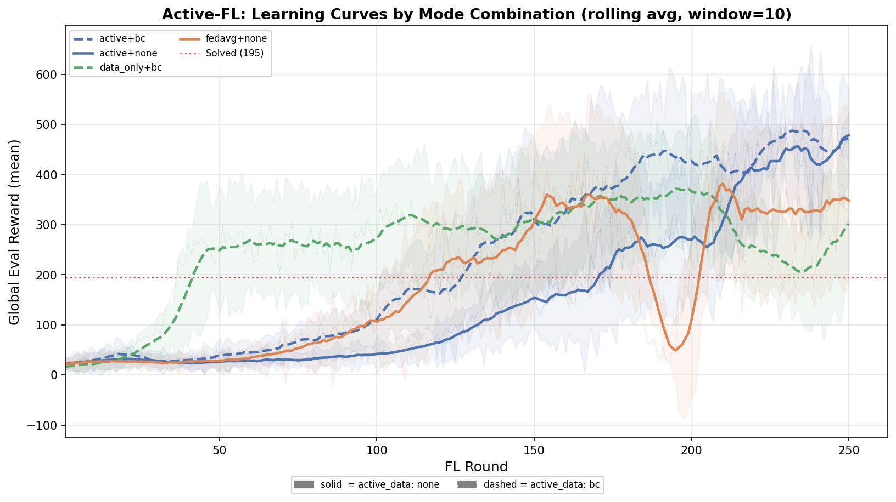
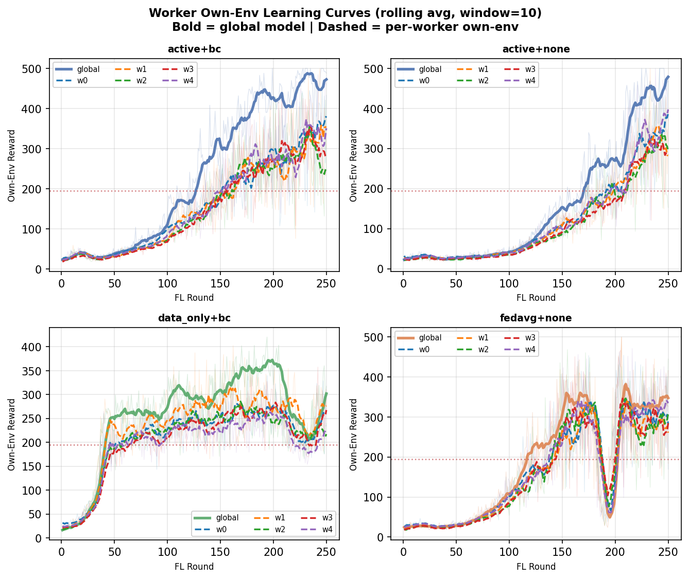
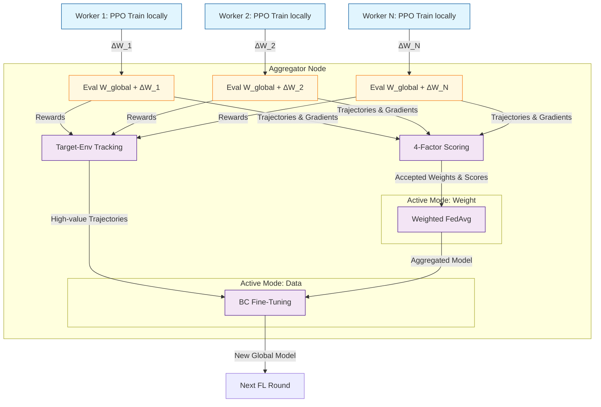
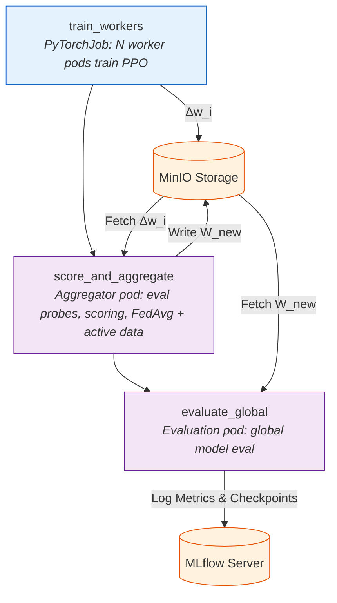

# Active-Federated Learning

**Federated Learning with active learning**: This project explores combining active learning strategies with federated learning. Instead of naive Federated Averaging (FedAvg), the central server evaluates and selects updates using **Active Weight** and **Active Data** methods to improve the global model.

The framework supports running experiments both **locally** (via parallel subprocesses) and remotely on **Kubernetes** (via Kubeflow Pipelines and PyTorchJobs).

---

## The Problem: Why Active Learning in Federated Learning?

In many Federated Learning scenarios, standard **FedAvg** works well when client datasets are relatively static and similar. However, it often struggles due to **non-stationarity and catastrophic forgetting**:
1. **High Variance in Updates**: Workers explore different parts of the environment or train on diverse local data. A client stuck in a bad local optimum will send a gradient update that disrupts the global model's progress.
2. **Sample and Resource Inefficiency**: Training locally requires interacting with environments or crunching local data. Blindly averaging bad weights means the global model regresses, wasting the compute and samples workers just collected.

**The Solution**: Instead of blindly averaging client weights, the central aggregator performs a **Target-Environment Probe**: evaluating each worker's proposed weight update (*ΔW*) directly in the target environment before accepting it.

Depending on how well the worker's update performs during this probe, the aggregator applies two active learning strategies:
- **Active Mode: Weight**: We use a 4-Factor Scoring mechanism (which heavily penalizes updates that regress target-environment performance) to compute a weighted FedAvg. Updates that perform poorly are rejected entirely.
- **Active Mode: Data**: For workers whose updates *do* significantly improve performance in the target environment, we capture the successful trajectories from their evaluation rollouts. We then use Behavioral Cloning (BC) to explicitly fine-tune the aggregated global model on these high-quality, provably successful trajectories.

---

## Experiment Results

Running all active learning combinations locally (`make run-experiments`) generates these comparison plots automatically:

### 1. Global Learning Curves
- **Behavioral Cloning (Data Only)**: Learns extremely fast early on, but is limited by the pure BC approach and fails to adapt or generalize to the environment, preventing it from achieving high final rewards.
- **FedAvg**: Suffers from catastrophic forgetting as local worker updates diverge, leading to a massive drop in performance midway through training.
- **Active FL**: Active methods learn steadily across all rounds. Combining **Active Weight + Active Data (BC)** dramatically accelerates learning with a much steeper curve and achieves the highest peak performance.



### 2. Worker Own-Environment Performance
- **Active Stability & Independence**: Active methods perform better globally and yield higher improvements, even if individual worker rewards in their own environments aren't as extremely high. The global model is stabilized without being strictly bound to the immediate whims of any one worker.
- **FedAvg Entanglement**: In contrast, the FedAvg baseline global reward (solid line) stays very close to the individual worker rewards, struggling with high variance and catastrophic forgetting as divergent local updates constantly overwrite each other.



---

## Architecture & Active Methods


```mermaid
graph TD
    classDef worker fill:#e1f5fe,stroke:#01579b
    classDef agg fill:#f3e5f5,stroke:#4a148c
    classDef probe fill:#fff8e1,stroke:#f57f17
    
    W1[Worker 1: PPO Train locally]:::worker
    W2[Worker 2: PPO Train locally]:::worker
    WN[Worker N: PPO Train locally]:::worker
    
    subgraph Aggregator Node
        Probe1[Eval W_global + ΔW_1]:::probe
        Probe2[Eval W_global + ΔW_2]:::probe
        ProbeN[Eval W_global + ΔW_N]:::probe
        
        Score[4-Factor Scoring]:::agg
        Target[Target-Env Tracking]:::agg
        
        subgraph Active Mode: Weight
            AW[Weighted FedAvg]:::agg
        end
        
        subgraph Active Mode: Data
            AD[BC Fine-Tuning]:::agg
        end
    end
    
    W1 -->|ΔW_1| Probe1
    W2 -->|ΔW_2| Probe2
    WN -->|ΔW_N| ProbeN
    
    Probe1 -->|Rewards| Target
    Probe2 -->|Rewards| Target
    ProbeN -->|Rewards| Target

    Probe1 -->|Trajectories & Gradients| Score
    Probe2 -->|Trajectories & Gradients| Score
    ProbeN -->|Trajectories & Gradients| Score
    
    Score -->|Accepted Weights & Scores| AW
    Target -->|High-value Trajectories| AD
    AW -->|Aggregated Model| AD
    AD -->|New Global Model| NextRound[Next FL Round]
```

Configure modes via `config/local.yaml` or `config/k8s.yaml`:

| `weight_mode` | `active_data_mode` | Description |
|---|---|---|
| `fedavg` | `none` | **Baseline** — vanilla equal-weight FedAvg, no active learning |
| `active` | `none` | **Active Weight only** — scored, importance-weighted FedAvg |
| `data_only` | `bc` | **Active Data only** — skip weight avg, BC fine-tune on probe trajectories |
| `active` | `bc` | **Both active paths** — scored FedAvg + BC fine-tune |

### Method 1: Active Weight (4-Factor Scoring)
Instead of equal-weight averaging, each client's *ΔW* is scored and softmax-normalized. A client is rejected entirely if its score falls below `score_threshold`. The score combines four signals:
1. **Target-env improvement (α)**: How much did this *ΔW* increase the target environment reward?
2. **Gradient norm (β)**: Penalize clients that barely moved their weights.
3. **Weight diversity (γ)**: Cosine distance from the mean update (penalize redundant updates).
4. **TD-error penalty (δ)**: Negative penalty for training instability.

### Method 2: Active Data (Fine-Tuning)
The trajectories captured during the Evaluation Probe are extremely valuable: they are guaranteed to be on-task and come from provably improved policies. 
We collect these trajectories and explicitly fine-tune the aggregated weights:
- **`bc` (Behavioral Cloning)**: Maximize the log-likelihood of the collected actions. Fast and stable.

---

## Use Case 1: Local Experiments (fast iteration, no infrastructure)

All 4 mode combinations run in parallel subprocesses via `ProcessPoolExecutor`. No Docker, no K8s, no MinIO — just Python. After all runs finish, comparison plots are generated automatically.

**When to use:** tuning hyperparameters, comparing modes, validating methodology, CI.

```bash
# Install
make install-dev

# Run tests
make test

# Run all combinations from config/local.yaml (parallel, auto-plots)
make run-experiments

# Smoke test — override rounds/workers/episodes via ARGS
make run-experiments ARGS="--rounds 2 --workers 2 --episodes 30"

# Skip auto-plotting
make run-experiments ARGS="--no-viz"

# Cap parallel experiments (e.g. 2 at a time)
make run-experiments ARGS="--jobs 2"

# Run a single combination
make run-single WEIGHT_MODE=data_only ACTIVE_DATA_MODE=bc

# View results in MLflow UI (local ./mlruns store)
make mlflow-ui
# Open http://localhost:5000

# Regenerate comparison plots from existing results
make compare
```

Outputs saved to `results/`:
- `<run_name>.json` — per-round metrics (reward, acceptance rate, active data usage)
- `results/plots/learning_curves.png`
- `results/plots/heatmap.png`
- `results/plots/final_reward_bar.png`
- `results/plots/acceptance_rate.png`
- `results/plots/active_data_usage.png`
- `results/plots/client_improvements.png`
- `results/plots/worker_own_env_curves.png`
- `results/plots/worker_target_env_curves.png`

**Configure in `config/local.yaml`** — edit `combinations:`, training rounds, workers, etc.

---

## Use Case 2: Kubernetes / Kubeflow Pipeline (real distributed FL)

Workers run as isolated pods (true process separation), weights and artifacts flow through MinIO, and metrics are tracked in a shared MLflow server. Kubeflow Pipelines orchestrates the DAG.

**When to use:** real federated scenario (workers on different machines/data), GPU training, production-scale runs, or when you need the full MLflow + artifact tracking pipeline.

### What runs in K8s


```mermaid
graph TD
    classDef job fill:#e3f2fd,stroke:#1565c0
    classDef pod fill:#f3e5f5,stroke:#6a1b9a
    classDef store fill:#fff3e0,stroke:#e65100
    
    Train[train_workers<br><i>PyTorchJob: N worker pods train PPO</i>]:::job
    Agg[score_and_aggregate<br><i>Aggregator pod: eval probes, scoring, FedAvg + active data</i>]:::pod
    Eval[evaluate_global<br><i>Evaluation pod: global model eval</i>]:::pod
    
    MinIO[(MinIO Storage)]:::store
    MLflow[(MLflow Server)]:::store
    
    Train -->|Δw_i| MinIO
    Train --> Agg
    MinIO -->|Fetch Δw_i| Agg
    Agg -->|Write W_new| MinIO
    Agg --> Eval
    MinIO -->|Fetch W_new| Eval
    Eval -->|Log Metrics & Checkpoints| MLflow
```

### What to see in Kubeflow UI
- **Pipeline graph**: per-round DAG with `train → aggregate → evaluate` chain
- **Pod logs**: per-worker training progress, client scores, improvement values
- **Artifacts**: aggregation report JSON (accepted/rejected clients with scores)

```bash
# Prerequisites: kind, kubectl, helm, docker

# 0. Initialize the vendor/fed-infra submodule (first checkout, or after a pull
#    that bumped it) — `make local-setup` also does this, but it's cheap to run
#    explicitly and is required before invoking vendor/fed-infra scripts directly.
git submodule update --init --recursive

# 1. Bootstrap local kind cluster (MinIO, MLflow, Kubeflow)
make local-setup

# 2. Run pipeline (uses config/k8s.yaml)
make run-pipeline

# Open UIs (after port-forward):
#   Kubeflow: http://localhost:8080
#   MLflow:   http://localhost:5050
#   MinIO:    http://localhost:9001

# 3. Fetch K8s MLflow results + generate plots
make compare-k8s

# 4. Teardown
make local-teardown
```

---

## Observability: Three Surfaces

Running the K8s pipeline (`make run-pipeline`) gives you three UIs, each answering a
different question. They never overlap in scope — KFP sequences *rounds*, Temporal manages
the worker *fleet inside* a round, and MLflow tracks *ML metrics* — so there's no ambiguity
about which one to open for a given question.

| Surface | URL | Answers |
|---|---|---|
| **Kubeflow Pipelines** | http://localhost:8080 | Round DAG (`train → aggregate → evaluate`), node logs, artifact lineage |
| **Temporal Web** | http://localhost:8233 | Which worker is running and for how long, retry counts, live per-worker progress |
| **MLflow** | http://localhost:5050 | Reward curves, client scores, acceptance rate, active-data usage |

### Reading per-worker progress in Temporal

Each FL round starts one `TrainRoundWorkflow` (workflow ID `train-<8hex>-r<round>`, where
`<8hex>` is the first 8 characters of the KFP run ID) that fans out one `WorkerWorkflow` child
per worker (`train-<8hex>-r<round>-w<worker>`). In the Temporal UI:

1. Open the `TrainRoundWorkflow` for the round you care about — it lists `N` `WorkerWorkflow`
   children (one per worker).
2. Open a child `WorkerWorkflow`. While its worker pod is training, the **Pending Activities**
   panel shows the `launch_and_watch_pod` activity with **heartbeat details** —
   `{"worker_id": ..., "active": ..., "waited_s": ...}` — updated every 5 seconds. This live
   heartbeat is what replaces the old PyTorchJob path's opaque 20-minute ceiling: you can see
   exactly which worker is still running and for how long, instead of waiting on one
   fleet-wide timer.
3. If the *activity code itself* fails or times out (e.g. an unrecoverable Kubernetes API
   error, or the pod-watch timeout), that `WorkerWorkflow` shows the retry attempt and the
   *root-cause* failure message for that worker specifically, not a generic whole-fleet error.
   **Known limitation:** if only the worker's *pod* is lost (killed, evicted, node drain) while
   its Job still has budget left, Kubernetes' own Job controller silently replaces the pod
   before the 5-second poll notices anything — the `WorkerWorkflow` then reports a clean
   success with no visible retry, even though a different pod actually did the work. Per-pod
   attribution is therefore only as good as what the Job object itself reports; check
   `kubectl get pods -n active-fed -l app=active-fl-worker` directly if you need to know
   whether a specific pod was replaced mid-round.
4. The underlying Kubernetes Job for each worker is named deterministically:
   `aflw-<8hex>-r<round>-w<worker>` — one Job per (round, worker), safe to re-attach to on
   retry instead of racing a second Job onto the same MinIO keys.

```bash
# Inspect worker Jobs/Pods for the current pipeline run
kubectl get jobs -n active-fed -l app=active-fl-worker
kubectl get pods -n active-fed -l app=active-fl-worker
```

---

## What to see in MLflow (Local & K8s)

Because both the local runner (`Use Case 1`) and the pipeline (`Use Case 2`) use the exact same MLflow tracking logic, you will see the exact same metrics and artifacts tracked over time in the MLflow UI (regardless of whether it's running locally in `./mlruns` or remotely in Kubernetes).

Each round logs:
- `global_eval_reward_mean` / `_std` / `solved`
- `clients_accepted` / `clients_rejected`
- `effective_weight_norm`
- `active_data_applied` / `active_data_n_steps` / `num_active_data_sources`
- `client_<id>_score` / `client_<id>_improvement` / `client_<id>_accepted`
- `client_<id>_own_env_reward_mean`
- `client_<id>_target_env_reward_mean` / `_std`
- Global model checkpoint artifact in `global_models/round_N/`
- Aggregation JSON report artifact in `reports/round_N/`

---

## Project Structure

```
src/
  agent/          PPO ActorCritic model, PPO agent, worker entrypoint
  aggregator/     Evaluator, scorer, aggregator (Active Weight + Data), MinIO collector
  experiment/     Local FL runner (no K8s)
  orchestration/  Temporal workflows/activities/worker entrypoint (per-round worker fleet)
  pipelines/      Kubeflow DSL pipeline definition (drives the fleet through Temporal)
  tracking/       MLflow helpers
config/
  local.yaml      Hyperparameters + combinations for local experiments
  k8s.yaml        Hyperparameters for Kubeflow pipelines
experiments/
  run_experiments.py  Local experiment orchestrator (parallel, auto-viz)
analysis/
  compare_runs.py     Comparison visualization (6 plots)
  fetch_k8s_runs.py   Download results from remote MLflow (K8s runs)
k8s/              Manifests: RBAC (worker Job + Temporal-worker access), Temporal worker Deployment
docker/           Worker + aggregator Dockerfiles
setup/            kind cluster bootstrap + teardown scripts (delegates to vendor/fed-infra)
run_pipeline.sh   Kubeflow pipeline trigger script
tests/            Unit tests across all components
results/          Experiment outputs (JSON + plots)
mlruns/           Local MLflow tracking store
```

## Makefile Quick Reference

```
make install          install prod deps (uv sync --no-dev)
make install-dev      install all deps including dev (uv sync --extra dev)
make test             run unit tests
make test-fast        run tests, skipping slow training tests
make lint             ruff check src/ tests/
make fmt              ruff format src/ tests/
make type-check       mypy src/
make run-experiments  run all combinations from config/local.yaml (parallel)
make run-single       WEIGHT_MODE=X ACTIVE_DATA_MODE=Y  (single combo)
make dry-run-worker   smoke-test worker entrypoint locally (no K8s)
make mlflow-ui        launch MLflow UI against ./mlruns (http://localhost:5000)
make temporal-ui      print the Temporal UI URL (http://localhost:8233)
make run-temporal-worker  run the orchestration worker locally (no K8s Deployment)
make compare          regenerate plots from results/
make compare-k8s      fetch remote MLflow results + regenerate plots
make compile-pipeline compile Kubeflow pipeline → /tmp/active_fl_pipeline.yaml
make run-pipeline     trigger the compiled pipeline locally
make build-images     build Docker images
make load-images      load into kind cluster
make local-setup      bootstrap kind cluster
make local-teardown   destroy kind cluster
make clean            remove __pycache__
make clean-results    remove results/ directory
```

## Disclaimer

This is a personal exploration project, not a formal research paper or production framework.

## License

This project is licensed under the MIT License - see the [LICENSE](LICENSE) file for details.
